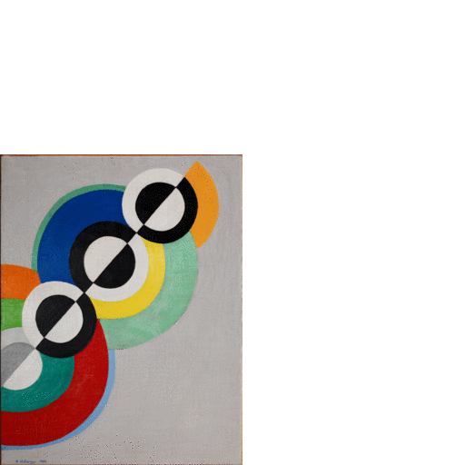
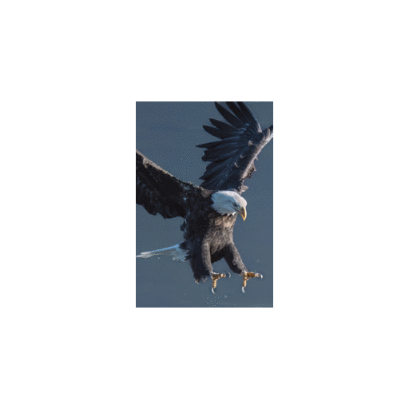

# dall-e-2-image-expand - Use DALL-E 2 to expand images (un-)reasonably

The [DALL-E 2 AI system from OpenAI](https://openai.com/dall-e-2/) allows to modify and expand existing pictures based on a description in natural language.

`dall-e-2-image-expand` is a command line application for doing so. Have fun!

## Examples

### An artistic expansions of Delaunay's Rhythmes with Bart Simpson

```
python3 dall-e-2-image-expand.py \
   -p "Artistic picture of Bart Simpson running away from colored circles like Delaunay Rhythmes" \
   -f 1.5 -i assets/delaunay_rhythmes.jpeg -H 0.0 -V 1.0
```



Original image: Rythmes by Delaunay, Robert, 1885-1941 - 1934 - Centre Pompidou - National museum for modern art - Industrial Design Centre, France - CC BY-NC-SA.
<a href="https://www.europeana.eu/item/2063621/FRA_280_010">Europeana.eu</a>

### Let's imagine this eagle was about to catch a goldfish

```
python3 dall-e-2-image-expand.py -p "An eagle in front of big mountains catching goldfish" \
                                 -f 2.0 -i assets/richard-lee-t5UqzNQrFIM-unsplash.jpg'
```



Original photo by <a href="https://unsplash.com/@brock222?utm_source=unsplash&utm_medium=referral&utm_content=creditCopyText">Richard Lee</a> on <a href="https://unsplash.com/photos/t5UqzNQrFIM?utm_source=unsplash&utm_medium=referral&utm_content=creditCopyText">Unsplash</a>

## Usage
Install the dependencies,
```
pip3 install Pillow openai
```

sign up at [OpenAI](https://beta.openai.com) and [generate an OpenAI API key](https://beta.openai.com/docs/api-reference/authentication) that you store in the environment variable that the tool reads,
```
export OPENAI_API_KEY=<your API key>
```

... and get started,
```
python3 dall-e-2-image-expand.py -h
